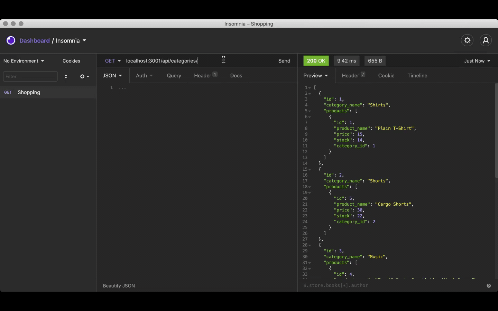

# E-commerce Back End

## Description

For this challenge, we were required to build the back end for an e-commerce site. You’ll take a working Express.js API and configure it to use Sequelize to interact with a MySQL database

## Application Demo

Schema and Seed Set Up


GET Routes to return all categories


GET Routes to return a single category


POST


PUT


DELETE


Full videos can be found in the VIDEOS folder within IMAGES.

## User Story

```md
AS A manager at an internet retail company
I WANT a back end for my e-commerce website that uses the latest technologies
SO THAT my company can compete with other e-commerce companies
```

## Criteria of the Project

```md
GIVEN a functional Express.js API
WHEN I add my database name, MySQL username, and MySQL password to an environment variable file
THEN I am able to connect to a database using Sequelize
WHEN I enter schema and seed commands
THEN a development database is created and is seeded with test data
WHEN I enter the command to invoke the application
THEN my server is started and the Sequelize models are synced to the MySQL database
WHEN I open API GET routes in Insomnia Core for categories, products, or tags
THEN the data for each of these routes is displayed in a formatted JSON
WHEN I test API POST, PUT, and DELETE routes in Insomnia Core
THEN I am able to successfully create, update, and delete data in my database
```
## GitHub Repo

https://github.com/aliciavega731/e-commerce-back-end

## Questions

If you have any other questions or concerns, please reach out via email aliciamvega94@gmail.com or via Github.